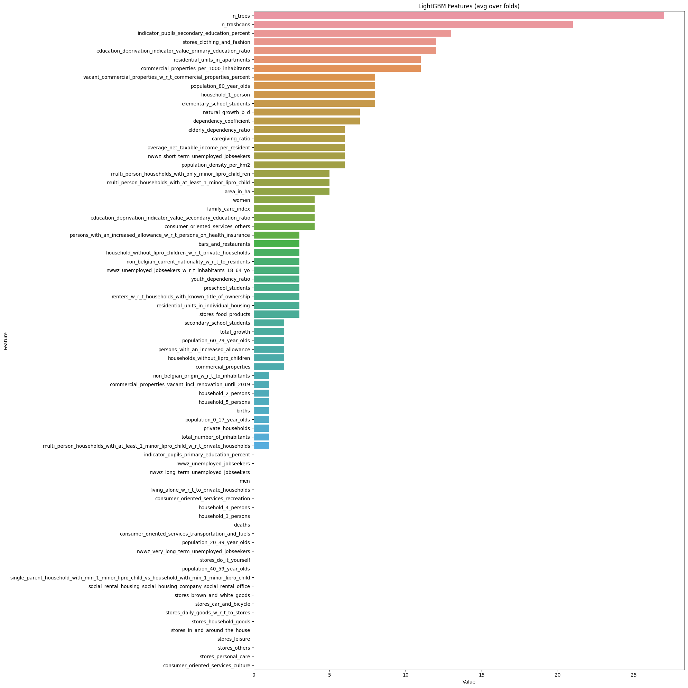
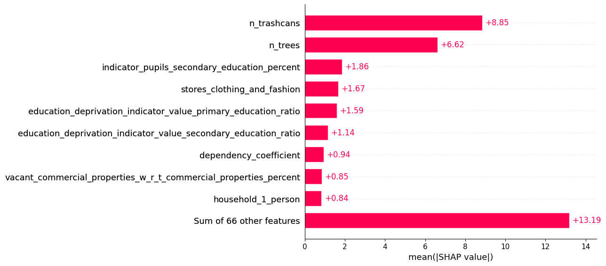
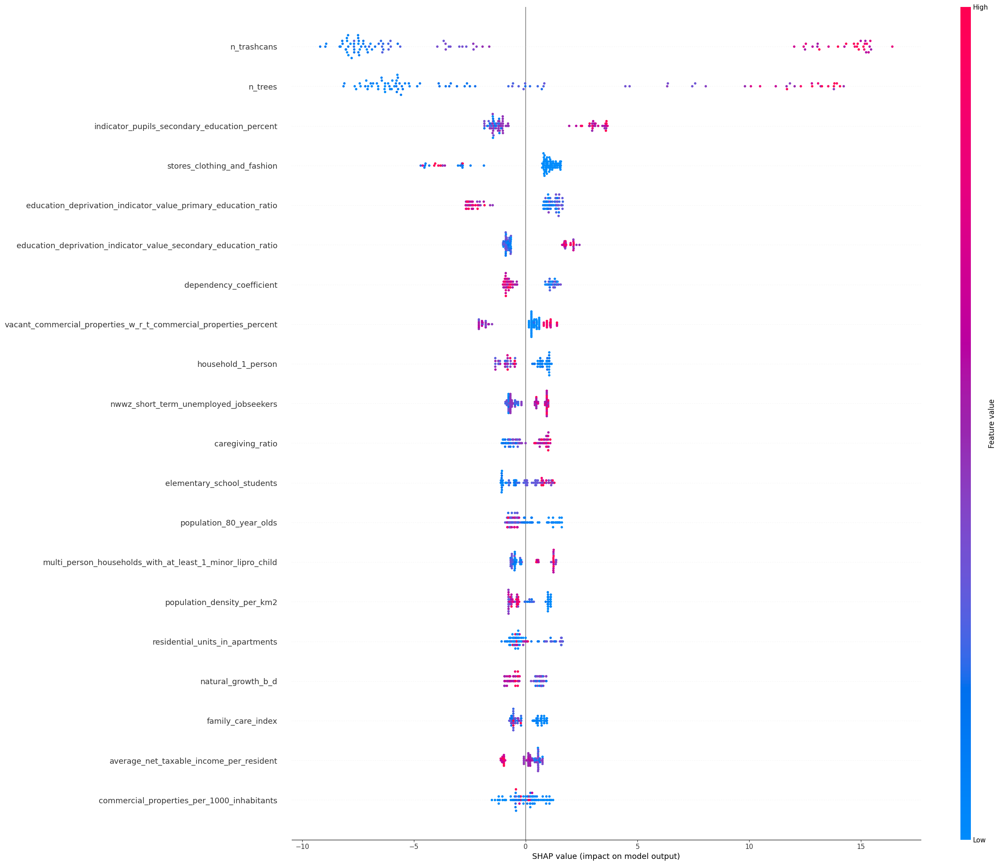
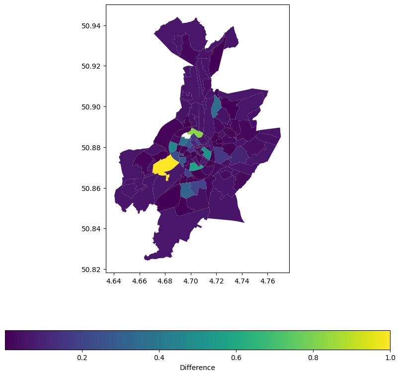

# Data 4 Good Challenge: Team 15

The following code is our final submission code of the Data 4 Good Challenge 2022.

A more in depth discussion is given in the following blog post: https://medium.com/p/b84e49e6ba06

# Imports


```python
import pandas as pd
import numpy as np
import matplotlib.pyplot as plt
import seaborn as sbn
import geopandas as gpd
import folium
#import mapclassify
from geopandas import GeoDataFrame
from sklearn.model_selection import train_test_split
from lightgbm import LGBMRegressor, plot_importance
from sklearn.preprocessing import OneHotEncoder
import shap
from sklearn.cluster import KMeans
```

# Setting up the data


```python
sector_geojson = gpd.read_file('data/NIS_Sectoren.geojson')
sector_geojson_GEO = sector_geojson[['NAAM','geometry']]

df = pd.read_csv('data/Data1_demographic_sector.csv')#, index_col = 'Year')
df['statistical_sector'] = df['statistical_sector'].str.upper()
df = pd.merge(df, sector_geojson_GEO, how='left', left_on='statistical_sector', right_on='NAAM')
df = df.drop(['ID', 'NAAM'],axis=1)


df_Geo = GeoDataFrame(df)
```

## Inspecting NaN-values
We will drop columns with more than 50 NaN's, interpolate all columns related to people and set to zero those related to commercial activities


```python
for i, el in enumerate(df_Geo.isna().sum()):
    print(str(df_Geo.columns.tolist()[i]) +": " + str(el))
```

    statistical_sector: 0
    n_trees: 0
    n_benches: 0
    n_trashcans: 0
    area_in_ha: 0
    total_number_of_inhabitants: 3
    population_density_per_km2: 3
    men: 3
    women: 4
    population_0_17_year_olds: 6
    population_20_39_year_olds: 4
    population_40_59_year_olds: 4
    population_60_79_year_olds: 4
    population_80_year_olds: 17
    births: 52
    deaths: 68
    natural_growth_b_d: 0
    total_growth: 0
    elderly_dependency_ratio: 4
    youth_dependency_ratio: 6
    caregiving_ratio: 5
    dependency_coefficient: 6
    family_care_index: 17
    non_belgian_current_nationality_w_r_t_to_residents: 6
    non_belgian_origin_w_r_t_to_inhabitants: 4
    private_households: 4
    households_without_lipro_children: 4
    multi_person_households_with_at_least_1_minor_lipro_child: 8
    multi_person_households_with_only_minor_lipro_child_ren: 18
    household_1_person: 5
    household_2_persons: 5
    household_3_persons: 10
    household_4_persons: 16
    household_5_persons: 28
    living_alone_w_r_t_to_private_households: 5
    household_without_lipro_children_w_r_t_private_households: 3
    multi_person_households_with_at_least_1_minor_lipro_child_w_r_t_private_households: 8
    single_parent_household_with_min_1_minor_lipro_child_vs_household_with_min_1_minor_lipro_child: 43
    nwwz_unemployed_jobseekers_w_r_t_inhabitants_18_64_yo: 13
    nwwz_unemployed_jobseekers: 13
    nwwz_short_term_unemployed_jobseekers: 23
    nwwz_long_term_unemployed_jobseekers: 54
    nwwz_very_long_term_unemployed_jobseekers: 45
    commercial_properties: 15
    commercial_properties_per_1000_inhabitants: 16
    stores_food_products: 15
    stores_personal_care: 15
    stores_clothing_and_fashion: 15
    stores_household_goods: 15
    stores_leisure: 15
    stores_in_and_around_the_house: 15
    stores_brown_and_white_goods: 15
    stores_car_and_bicycle: 15
    stores_do_it_yourself: 15
    stores_others: 15
    bars_and_restaurants: 15
    consumer_oriented_services_culture: 15
    consumer_oriented_services_transportation_and_fuels: 15
    consumer_oriented_services_recreation: 15
    consumer_oriented_services_others: 15
    commercial_properties_vacant_incl_renovation_until_2019: 15
    vacant_commercial_properties_w_r_t_commercial_properties_percent: 66
    stores_daily_goods_w_r_t_to_stores: 48
    commercial_properties_other_retail_w_r_t_to_retail: 96
    stores_periodic_goods_w_r_t_stores: 78
    stores_periodic_goods_vs_stores: 71
    residential_units_in_apartments: 21
    residential_units_in_collective_housing: 96
    residential_units_in_individual_housing: 4
    renters_w_r_t_households_with_known_title_of_ownership: 8
    social_rental_housing_social_housing_company_social_rental_office: 0
    persons_with_an_increased_allowance: 14
    persons_with_an_increased_allowance_w_r_t_persons_on_health_insurance: 14
    average_net_taxable_income_per_resident: 10
    preschool_students: 19
    elementary_school_students: 12
    secondary_school_students: 13
    indicator_pupils_primary_education_percent: 26
    indicator_pupils_secondary_education_percent: 32
    education_deprivation_indicator_value_primary_education_ratio: 10
    education_deprivation_indicator_value_secondary_education_ratio: 14
    geometry: 1


```python
df_Geo_dropna = df_Geo.dropna(axis=1, thresh=50)
for i, el in enumerate(df_Geo_dropna.isna().sum()):
    if el > 0:
        print(str(df_Geo_dropna.columns.tolist()[i]) +": " + str(el))
```

    total_number_of_inhabitants: 3
    population_density_per_km2: 3
    men: 3
    women: 4
    population_0_17_year_olds: 6
    population_20_39_year_olds: 4
    population_40_59_year_olds: 4
    population_60_79_year_olds: 4
    population_80_year_olds: 17
    births: 52
    deaths: 68
    elderly_dependency_ratio: 4
    youth_dependency_ratio: 6
    caregiving_ratio: 5
    dependency_coefficient: 6
    family_care_index: 17
    non_belgian_current_nationality_w_r_t_to_residents: 6
    non_belgian_origin_w_r_t_to_inhabitants: 4
    private_households: 4
    households_without_lipro_children: 4
    multi_person_households_with_at_least_1_minor_lipro_child: 8
    multi_person_households_with_only_minor_lipro_child_ren: 18
    household_1_person: 5
    household_2_persons: 5
    household_3_persons: 10
    household_4_persons: 16
    household_5_persons: 28
    living_alone_w_r_t_to_private_households: 5
    household_without_lipro_children_w_r_t_private_households: 3
    multi_person_households_with_at_least_1_minor_lipro_child_w_r_t_private_households: 8
    single_parent_household_with_min_1_minor_lipro_child_vs_household_with_min_1_minor_lipro_child: 43
    nwwz_unemployed_jobseekers_w_r_t_inhabitants_18_64_yo: 13
    nwwz_unemployed_jobseekers: 13
    nwwz_short_term_unemployed_jobseekers: 23
    nwwz_long_term_unemployed_jobseekers: 54
    nwwz_very_long_term_unemployed_jobseekers: 45
    commercial_properties: 15
    commercial_properties_per_1000_inhabitants: 16
    stores_food_products: 15
    stores_personal_care: 15
    stores_clothing_and_fashion: 15
    stores_household_goods: 15
    stores_leisure: 15
    stores_in_and_around_the_house: 15
    stores_brown_and_white_goods: 15
    stores_car_and_bicycle: 15
    stores_do_it_yourself: 15
    stores_others: 15
    bars_and_restaurants: 15
    consumer_oriented_services_culture: 15
    consumer_oriented_services_transportation_and_fuels: 15
    consumer_oriented_services_recreation: 15
    consumer_oriented_services_others: 15
    commercial_properties_vacant_incl_renovation_until_2019: 15
    vacant_commercial_properties_w_r_t_commercial_properties_percent: 66
    stores_daily_goods_w_r_t_to_stores: 48
    residential_units_in_apartments: 21
    residential_units_in_individual_housing: 4
    renters_w_r_t_households_with_known_title_of_ownership: 8
    persons_with_an_increased_allowance: 14
    persons_with_an_increased_allowance_w_r_t_persons_on_health_insurance: 14
    average_net_taxable_income_per_resident: 10
    preschool_students: 19
    elementary_school_students: 12
    secondary_school_students: 13
    indicator_pupils_primary_education_percent: 26
    indicator_pupils_secondary_education_percent: 32
    education_deprivation_indicator_value_primary_education_ratio: 10
    education_deprivation_indicator_value_secondary_education_ratio: 14
    geometry: 1


```python
mean_columns = ['total_number_of_inhabitants', 'population_density_per_km2', 'men', 'women', 'population_0_17_year_olds', 'population_20_39_year_olds', 'population_40_59_year_olds', 'population_60_79_year_olds', 'population_80_year_olds', 'births', 'deaths', 'elderly_dependency_ratio', 'youth_dependency_ratio', 'caregiving_ratio', 'dependency_coefficient', 'family_care_index', 'non_belgian_current_nationality_w_r_t_to_residents', 'non_belgian_origin_w_r_t_to_inhabitants', 'private_households', 'households_without_lipro_children', 'multi_person_households_with_at_least_1_minor_lipro_child', 'multi_person_households_with_only_minor_lipro_child_ren', 'household_1_person', 'household_2_persons', 'household_3_persons', 'household_4_persons', 'household_5_persons', 'living_alone_w_r_t_to_private_households', 'household_without_lipro_children_w_r_t_private_households', 'multi_person_households_with_at_least_1_minor_lipro_child_w_r_t_private_households', 'single_parent_household_with_min_1_minor_lipro_child_vs_household_with_min_1_minor_lipro_child', 'nwwz_unemployed_jobseekers_w_r_t_inhabitants_18_64_yo', 'nwwz_unemployed_jobseekers', 'nwwz_short_term_unemployed_jobseekers', 'nwwz_long_term_unemployed_jobseekers', 'nwwz_very_long_term_unemployed_jobseekers', 'renters_w_r_t_households_with_known_title_of_ownership', 'persons_with_an_increased_allowance', 'persons_with_an_increased_allowance_w_r_t_persons_on_health_insurance', 'average_net_taxable_income_per_resident', 'preschool_students', 'elementary_school_students', 'secondary_school_students', 'indicator_pupils_primary_education_percent', 'indicator_pupils_secondary_education_percent', 'education_deprivation_indicator_value_primary_education_ratio', 'education_deprivation_indicator_value_secondary_education_ratio', 'geometry']

zero_columns = ['commercial_properties', 'commercial_properties_per_1000_inhabitants', 'stores_food_products', 'stores_personal_care', 'stores_clothing_and_fashion', 'stores_household_goods', 'stores_leisure', 'stores_in_and_around_the_house', 'stores_brown_and_white_goods', 'stores_car_and_bicycle', 'stores_do_it_yourself', 'stores_others', 'bars_and_restaurants', 'consumer_oriented_services_culture', 'consumer_oriented_services_transportation_and_fuels', 'consumer_oriented_services_recreation', 'consumer_oriented_services_others', 'commercial_properties_vacant_incl_renovation_until_2019', 'vacant_commercial_properties_w_r_t_commercial_properties_percent', 'stores_daily_goods_w_r_t_to_stores', 'residential_units_in_apartments', 'residential_units_in_individual_housing']
```


```python
df_fillna = df_Geo_dropna
df_fillna[mean_columns] = df_Geo_dropna[mean_columns].fillna(df_Geo_dropna[mean_columns].mean())
df_fillna[zero_columns] = df_Geo_dropna[zero_columns].fillna(0)
```


```python
X = df_fillna.drop(labels =["n_benches", "geometry", "statistical_sector"], axis=1)
y = df_Geo["n_benches"]
```

# LightGBM
A gradient boosted tree is trained and the model is inspected with respect to feature importance and shapley values


```python
X_train, X_val, y_train, y_val = train_test_split(X, y, test_size=0.2, random_state=42)
```


```python
model = LGBMRegressor(max_depth=10)
```


```python
model.fit(X_train, y_train)
```


<style>#sk-container-id-5 {color: black;background-color: white;}#sk-container-id-5 pre{padding: 0;}#sk-container-id-5 div.sk-toggleable {background-color: white;}#sk-container-id-5 label.sk-toggleable__label {cursor: pointer;display: block;width: 100%;margin-bottom: 0;padding: 0.3em;box-sizing: border-box;text-align: center;}#sk-container-id-5 label.sk-toggleable__label-arrow:before {content: "▸";float: left;margin-right: 0.25em;color: #696969;}#sk-container-id-5 label.sk-toggleable__label-arrow:hover:before {color: black;}#sk-container-id-5 div.sk-estimator:hover label.sk-toggleable__label-arrow:before {color: black;}#sk-container-id-5 div.sk-toggleable__content {max-height: 0;max-width: 0;overflow: hidden;text-align: left;background-color: #f0f8ff;}#sk-container-id-5 div.sk-toggleable__content pre {margin: 0.2em;color: black;border-radius: 0.25em;background-color: #f0f8ff;}#sk-container-id-5 input.sk-toggleable__control:checked~div.sk-toggleable__content {max-height: 200px;max-width: 100%;overflow: auto;}#sk-container-id-5 input.sk-toggleable__control:checked~label.sk-toggleable__label-arrow:before {content: "▾";}#sk-container-id-5 div.sk-estimator input.sk-toggleable__control:checked~label.sk-toggleable__label {background-color: #d4ebff;}#sk-container-id-5 div.sk-label input.sk-toggleable__control:checked~label.sk-toggleable__label {background-color: #d4ebff;}#sk-container-id-5 input.sk-hidden--visually {border: 0;clip: rect(1px 1px 1px 1px);clip: rect(1px, 1px, 1px, 1px);height: 1px;margin: -1px;overflow: hidden;padding: 0;position: absolute;width: 1px;}#sk-container-id-5 div.sk-estimator {font-family: monospace;background-color: #f0f8ff;border: 1px dotted black;border-radius: 0.25em;box-sizing: border-box;margin-bottom: 0.5em;}#sk-container-id-5 div.sk-estimator:hover {background-color: #d4ebff;}#sk-container-id-5 div.sk-parallel-item::after {content: "";width: 100%;border-bottom: 1px solid gray;flex-grow: 1;}#sk-container-id-5 div.sk-label:hover label.sk-toggleable__label {background-color: #d4ebff;}#sk-container-id-5 div.sk-serial::before {content: "";position: absolute;border-left: 1px solid gray;box-sizing: border-box;top: 0;bottom: 0;left: 50%;z-index: 0;}#sk-container-id-5 div.sk-serial {display: flex;flex-direction: column;align-items: center;background-color: white;padding-right: 0.2em;padding-left: 0.2em;position: relative;}#sk-container-id-5 div.sk-item {position: relative;z-index: 1;}#sk-container-id-5 div.sk-parallel {display: flex;align-items: stretch;justify-content: center;background-color: white;position: relative;}#sk-container-id-5 div.sk-item::before, #sk-container-id-5 div.sk-parallel-item::before {content: "";position: absolute;border-left: 1px solid gray;box-sizing: border-box;top: 0;bottom: 0;left: 50%;z-index: -1;}#sk-container-id-5 div.sk-parallel-item {display: flex;flex-direction: column;z-index: 1;position: relative;background-color: white;}#sk-container-id-5 div.sk-parallel-item:first-child::after {align-self: flex-end;width: 50%;}#sk-container-id-5 div.sk-parallel-item:last-child::after {align-self: flex-start;width: 50%;}#sk-container-id-5 div.sk-parallel-item:only-child::after {width: 0;}#sk-container-id-5 div.sk-dashed-wrapped {border: 1px dashed gray;margin: 0 0.4em 0.5em 0.4em;box-sizing: border-box;padding-bottom: 0.4em;background-color: white;}#sk-container-id-5 div.sk-label label {font-family: monospace;font-weight: bold;display: inline-block;line-height: 1.2em;}#sk-container-id-5 div.sk-label-container {text-align: center;}#sk-container-id-5 div.sk-container {/* jupyter's `normalize.less` sets `[hidden] { display: none; }` but bootstrap.min.css set `[hidden] { display: none !important; }` so we also need the `!important` here to be able to override the default hidden behavior on the sphinx rendered scikit-learn.org. See: https://github.com/scikit-learn/scikit-learn/issues/21755 */display: inline-block !important;position: relative;}#sk-container-id-5 div.sk-text-repr-fallback {display: none;}</style><div id="sk-container-id-5" class="sk-top-container"><div class="sk-text-repr-fallback"><pre>LGBMRegressor(max_depth=10)</pre><b>In a Jupyter environment, please rerun this cell to show the HTML representation or trust the notebook. <br />On GitHub, the HTML representation is unable to render, please try loading this page with nbviewer.org.</b></div><div class="sk-container" hidden><div class="sk-item"><div class="sk-estimator sk-toggleable"><input class="sk-toggleable__control sk-hidden--visually" id="sk-estimator-id-5" type="checkbox" checked><label for="sk-estimator-id-5" class="sk-toggleable__label sk-toggleable__label-arrow">LGBMRegressor</label><div class="sk-toggleable__content"><pre>LGBMRegressor(max_depth=10)</pre></div></div></div></div></div>


```python
import matplotlib.pyplot as plt
import seaborn as sns
# plot_importance(model, max_num_features = 60, height=1)

feature_imp = pd.DataFrame(sorted(zip(model.feature_importances_,X.columns)), columns=['Value','Feature'])

plt.figure(figsize=(20, 20))
sns.barplot(x="Value", y="Feature", data=feature_imp.sort_values(by="Value", ascending=False))
plt.title('LightGBM Features (avg over folds)')
plt.tight_layout()
plt.show()
plt.savefig('lgbm_importances-01.png')

```


    

    


    <Figure size 640x480 with 0 Axes>


```python
explainer = shap.Explainer(model.predict, X_train)
shap_values = explainer(X_train)
```

    Permutation explainer: 95it [00:58,  1.34it/s]                        


```python
shap.plots.bar(shap_values)
```


    

    


```python
shap.summary_plot(shap_values, plot_size=(25,20))
```


    

    


# Mapping differences: Validation


```python
scale = lambda col: abs((col-col.mean()).div(col.max()))

def mutateDF(df, keys, factors, nan_handlers):
	df['value'] = np.zeros(len(df_Geo))
	for index, key in enumerate(keys):
		df['temp'] = df[key].fillna(nan_handlers[index])
		df['temp'] = scale(df['temp'])*factors[index]
		df['value'] += df['temp']**2
	df['value'] *= abs(1-scale(df['n_benches'])**1.72)
	df['value'] = df['value'].div(df['value'].max()).fillna(0)
	df.plot('value', legend=True, legend_kwds={'label': "Difference",'orientation': "horizontal"}, figsize=(10,10))
	plt.show()
```


```python
df = df_Geo.copy(deep=True)
df['FChanceperChild'] = (df_Geo['average_net_taxable_income_per_resident'].replace(np.nan, 0)/(df_Geo['youth_dependency_ratio']).fillna(df_Geo['youth_dependency_ratio'].median()))
df['FChanceperChild'] = df['FChanceperChild'].max() - df['FChanceperChild']
df['stores'] = df_Geo['stores_clothing_and_fashion'].fillna(0) + df_Geo['stores_food_products'].fillna(0)

keys = ['FChanceperChild', 'non_belgian_current_nationality_w_r_t_to_residents', 'stores','indicator_pupils_secondary_education_percent','residential_units_in_apartments']
# Play with these factors to give a different view on the city of Leuven and it's differences
# Setting multiple factors to non-zero combines different pieces of information in a clever way
factors = [0,0,0,0,1]
nan_handlers = [df['FChanceperChild'].median(), df['non_belgian_current_nationality_w_r_t_to_residents'].median(), 0, df['indicator_pupils_secondary_education_percent'].median(),0]

mutateDF(df, keys, factors, nan_handlers)
```


    

    


In the plot above, values close to zero indicate that these regions are very close to the average, whereas higher values indicate more differences. 

# Clustering: K-means


```python
x_coor = pd.Series(df_Geo['geometry'].centroid.x, name="X")
y_coor = pd.Series(df_Geo['geometry'].centroid.y, name="Y")
coor = pd.concat([x_coor, y_coor], axis=1)
```


```python
columns_to_use_clustering = ['n_trees', 'n_trashcans', 'indicator_pupils_secondary_education_percent', 'stores_clothing_and_fashion', 'education_deprivation_indicator_value_primary_education_ratio', 'residential_units_in_apartments', 'commercial_properties_per_1000_inhabitants', 'population_80_year_olds', 'household_1_person', 'elementary_school_students']
```


```python
df_Geo_dropna = df_Geo.dropna(axis=1, thresh=50)
mean_columns = ['total_number_of_inhabitants', 'population_density_per_km2', 'men', 'women', 'population_0_17_year_olds', 'population_20_39_year_olds', 'population_40_59_year_olds', 'population_60_79_year_olds', 'population_80_year_olds', 'births', 'deaths', 'elderly_dependency_ratio', 'youth_dependency_ratio', 'caregiving_ratio', 'dependency_coefficient', 'family_care_index', 'non_belgian_current_nationality_w_r_t_to_residents', 'non_belgian_origin_w_r_t_to_inhabitants', 'private_households', 'households_without_lipro_children', 'multi_person_households_with_at_least_1_minor_lipro_child', 'multi_person_households_with_only_minor_lipro_child_ren', 'household_1_person', 'household_2_persons', 'household_3_persons', 'household_4_persons', 'household_5_persons', 'living_alone_w_r_t_to_private_households', 'household_without_lipro_children_w_r_t_private_households', 'multi_person_households_with_at_least_1_minor_lipro_child_w_r_t_private_households', 'single_parent_household_with_min_1_minor_lipro_child_vs_household_with_min_1_minor_lipro_child', 'nwwz_unemployed_jobseekers_w_r_t_inhabitants_18_64_yo', 'nwwz_unemployed_jobseekers', 'nwwz_short_term_unemployed_jobseekers', 'nwwz_long_term_unemployed_jobseekers', 'nwwz_very_long_term_unemployed_jobseekers', 'renters_w_r_t_households_with_known_title_of_ownership', 'persons_with_an_increased_allowance', 'persons_with_an_increased_allowance_w_r_t_persons_on_health_insurance', 'average_net_taxable_income_per_resident', 'preschool_students', 'elementary_school_students', 'secondary_school_students', 'indicator_pupils_primary_education_percent', 'indicator_pupils_secondary_education_percent', 'education_deprivation_indicator_value_primary_education_ratio', 'education_deprivation_indicator_value_secondary_education_ratio', 'geometry']

zero_columns = ['commercial_properties', 'commercial_properties_per_1000_inhabitants', 'stores_food_products', 'stores_personal_care', 'stores_clothing_and_fashion', 'stores_household_goods', 'stores_leisure', 'stores_in_and_around_the_house', 'stores_brown_and_white_goods', 'stores_car_and_bicycle', 'stores_do_it_yourself', 'stores_others', 'bars_and_restaurants', 'consumer_oriented_services_culture', 'consumer_oriented_services_transportation_and_fuels', 'consumer_oriented_services_recreation', 'consumer_oriented_services_others', 'commercial_properties_vacant_incl_renovation_until_2019', 'vacant_commercial_properties_w_r_t_commercial_properties_percent', 'stores_daily_goods_w_r_t_to_stores', 'residential_units_in_apartments', 'residential_units_in_individual_housing']

df_fillna = df_Geo_dropna
df_fillna[mean_columns] = df_Geo_dropna[mean_columns].fillna(df_Geo_dropna[mean_columns].mean())
df_fillna[zero_columns] = df_Geo_dropna[zero_columns].fillna(0)

X_no_nans = df_fillna.drop(labels =["n_benches", "geometry", "statistical_sector"], axis=1)
```


```python
X = pd.concat([coor, X_no_nans[columns_to_use_clustering]], axis=1)
X.drop(71, axis=0, inplace=True) # Row 71 has no X and Y coor
display(X)
```


<div>
<style scoped>
    .dataframe tbody tr th:only-of-type {
        vertical-align: middle;
    }

    .dataframe tbody tr th {
        vertical-align: top;
    }

    .dataframe thead th {
        text-align: right;
    }
</style>
<table border="1" class="dataframe">
  <thead>
    <tr style="text-align: right;">
      <th></th>
      <th>X</th>
      <th>Y</th>
      <th>n_trees</th>
      <th>n_trashcans</th>
      <th>indicator_pupils_secondary_education_percent</th>
      <th>stores_clothing_and_fashion</th>
      <th>education_deprivation_indicator_value_primary_education_ratio</th>
      <th>residential_units_in_apartments</th>
      <th>commercial_properties_per_1000_inhabitants</th>
      <th>population_80_year_olds</th>
      <th>household_1_person</th>
      <th>elementary_school_students</th>
    </tr>
  </thead>
  <tbody>
    <tr>
      <th>0</th>
      <td>4.653820</td>
      <td>50.871052</td>
      <td>363</td>
      <td>3</td>
      <td>0.420512</td>
      <td>0.0</td>
      <td>0.42000</td>
      <td>0.0</td>
      <td>10.99</td>
      <td>11.00000</td>
      <td>11.000000</td>
      <td>17.00000</td>
    </tr>
    <tr>
      <th>1</th>
      <td>4.688854</td>
      <td>50.875852</td>
      <td>561</td>
      <td>51</td>
      <td>0.449000</td>
      <td>0.0</td>
      <td>0.84000</td>
      <td>1295.0</td>
      <td>6.45</td>
      <td>74.00000</td>
      <td>834.000000</td>
      <td>70.00000</td>
    </tr>
    <tr>
      <th>2</th>
      <td>4.715330</td>
      <td>50.906038</td>
      <td>13</td>
      <td>0</td>
      <td>0.420512</td>
      <td>0.0</td>
      <td>0.50000</td>
      <td>0.0</td>
      <td>15.38</td>
      <td>7.00000</td>
      <td>217.283186</td>
      <td>7.00000</td>
    </tr>
    <tr>
      <th>3</th>
      <td>4.723311</td>
      <td>50.875958</td>
      <td>558</td>
      <td>16</td>
      <td>0.363000</td>
      <td>1.0</td>
      <td>0.58000</td>
      <td>749.0</td>
      <td>6.52</td>
      <td>140.00000</td>
      <td>593.000000</td>
      <td>220.00000</td>
    </tr>
    <tr>
      <th>4</th>
      <td>4.729917</td>
      <td>50.900495</td>
      <td>437</td>
      <td>14</td>
      <td>0.419000</td>
      <td>0.0</td>
      <td>0.92000</td>
      <td>203.0</td>
      <td>6.52</td>
      <td>103.00000</td>
      <td>302.000000</td>
      <td>163.00000</td>
    </tr>
    <tr>
      <th>...</th>
      <td>...</td>
      <td>...</td>
      <td>...</td>
      <td>...</td>
      <td>...</td>
      <td>...</td>
      <td>...</td>
      <td>...</td>
      <td>...</td>
      <td>...</td>
      <td>...</td>
      <td>...</td>
    </tr>
    <tr>
      <th>113</th>
      <td>4.697274</td>
      <td>50.892103</td>
      <td>123</td>
      <td>10</td>
      <td>0.438000</td>
      <td>0.0</td>
      <td>1.85000</td>
      <td>296.0</td>
      <td>6.48</td>
      <td>48.00000</td>
      <td>205.000000</td>
      <td>70.00000</td>
    </tr>
    <tr>
      <th>114</th>
      <td>4.701458</td>
      <td>50.893304</td>
      <td>16</td>
      <td>3</td>
      <td>0.154000</td>
      <td>0.0</td>
      <td>0.34000</td>
      <td>34.0</td>
      <td>3.38</td>
      <td>54.00000</td>
      <td>114.000000</td>
      <td>34.00000</td>
    </tr>
    <tr>
      <th>115</th>
      <td>4.763481</td>
      <td>50.887407</td>
      <td>103</td>
      <td>0</td>
      <td>0.222000</td>
      <td>0.0</td>
      <td>0.51000</td>
      <td>14.0</td>
      <td>12.46</td>
      <td>17.00000</td>
      <td>37.000000</td>
      <td>28.00000</td>
    </tr>
    <tr>
      <th>116</th>
      <td>4.734623</td>
      <td>50.867354</td>
      <td>83</td>
      <td>3</td>
      <td>0.420512</td>
      <td>0.0</td>
      <td>0.25000</td>
      <td>21.0</td>
      <td>30.86</td>
      <td>16.00000</td>
      <td>40.000000</td>
      <td>34.00000</td>
    </tr>
    <tr>
      <th>117</th>
      <td>4.704818</td>
      <td>50.891298</td>
      <td>105</td>
      <td>5</td>
      <td>0.420512</td>
      <td>2.0</td>
      <td>0.95537</td>
      <td>6.0</td>
      <td>258.62</td>
      <td>53.50495</td>
      <td>8.000000</td>
      <td>55.90566</td>
    </tr>
  </tbody>
</table>
<p>117 rows × 12 columns</p>
</div>


```python
X_train, X_val = train_test_split(X, test_size=0.2, random_state=42)
```


```python
model = KMeans(n_clusters=15)
```


```python
model.fit(X_train)
```


<style>#sk-container-id-6 {color: black;background-color: white;}#sk-container-id-6 pre{padding: 0;}#sk-container-id-6 div.sk-toggleable {background-color: white;}#sk-container-id-6 label.sk-toggleable__label {cursor: pointer;display: block;width: 100%;margin-bottom: 0;padding: 0.3em;box-sizing: border-box;text-align: center;}#sk-container-id-6 label.sk-toggleable__label-arrow:before {content: "▸";float: left;margin-right: 0.25em;color: #696969;}#sk-container-id-6 label.sk-toggleable__label-arrow:hover:before {color: black;}#sk-container-id-6 div.sk-estimator:hover label.sk-toggleable__label-arrow:before {color: black;}#sk-container-id-6 div.sk-toggleable__content {max-height: 0;max-width: 0;overflow: hidden;text-align: left;background-color: #f0f8ff;}#sk-container-id-6 div.sk-toggleable__content pre {margin: 0.2em;color: black;border-radius: 0.25em;background-color: #f0f8ff;}#sk-container-id-6 input.sk-toggleable__control:checked~div.sk-toggleable__content {max-height: 200px;max-width: 100%;overflow: auto;}#sk-container-id-6 input.sk-toggleable__control:checked~label.sk-toggleable__label-arrow:before {content: "▾";}#sk-container-id-6 div.sk-estimator input.sk-toggleable__control:checked~label.sk-toggleable__label {background-color: #d4ebff;}#sk-container-id-6 div.sk-label input.sk-toggleable__control:checked~label.sk-toggleable__label {background-color: #d4ebff;}#sk-container-id-6 input.sk-hidden--visually {border: 0;clip: rect(1px 1px 1px 1px);clip: rect(1px, 1px, 1px, 1px);height: 1px;margin: -1px;overflow: hidden;padding: 0;position: absolute;width: 1px;}#sk-container-id-6 div.sk-estimator {font-family: monospace;background-color: #f0f8ff;border: 1px dotted black;border-radius: 0.25em;box-sizing: border-box;margin-bottom: 0.5em;}#sk-container-id-6 div.sk-estimator:hover {background-color: #d4ebff;}#sk-container-id-6 div.sk-parallel-item::after {content: "";width: 100%;border-bottom: 1px solid gray;flex-grow: 1;}#sk-container-id-6 div.sk-label:hover label.sk-toggleable__label {background-color: #d4ebff;}#sk-container-id-6 div.sk-serial::before {content: "";position: absolute;border-left: 1px solid gray;box-sizing: border-box;top: 0;bottom: 0;left: 50%;z-index: 0;}#sk-container-id-6 div.sk-serial {display: flex;flex-direction: column;align-items: center;background-color: white;padding-right: 0.2em;padding-left: 0.2em;position: relative;}#sk-container-id-6 div.sk-item {position: relative;z-index: 1;}#sk-container-id-6 div.sk-parallel {display: flex;align-items: stretch;justify-content: center;background-color: white;position: relative;}#sk-container-id-6 div.sk-item::before, #sk-container-id-6 div.sk-parallel-item::before {content: "";position: absolute;border-left: 1px solid gray;box-sizing: border-box;top: 0;bottom: 0;left: 50%;z-index: -1;}#sk-container-id-6 div.sk-parallel-item {display: flex;flex-direction: column;z-index: 1;position: relative;background-color: white;}#sk-container-id-6 div.sk-parallel-item:first-child::after {align-self: flex-end;width: 50%;}#sk-container-id-6 div.sk-parallel-item:last-child::after {align-self: flex-start;width: 50%;}#sk-container-id-6 div.sk-parallel-item:only-child::after {width: 0;}#sk-container-id-6 div.sk-dashed-wrapped {border: 1px dashed gray;margin: 0 0.4em 0.5em 0.4em;box-sizing: border-box;padding-bottom: 0.4em;background-color: white;}#sk-container-id-6 div.sk-label label {font-family: monospace;font-weight: bold;display: inline-block;line-height: 1.2em;}#sk-container-id-6 div.sk-label-container {text-align: center;}#sk-container-id-6 div.sk-container {/* jupyter's `normalize.less` sets `[hidden] { display: none; }` but bootstrap.min.css set `[hidden] { display: none !important; }` so we also need the `!important` here to be able to override the default hidden behavior on the sphinx rendered scikit-learn.org. See: https://github.com/scikit-learn/scikit-learn/issues/21755 */display: inline-block !important;position: relative;}#sk-container-id-6 div.sk-text-repr-fallback {display: none;}</style><div id="sk-container-id-6" class="sk-top-container"><div class="sk-text-repr-fallback"><pre>KMeans(n_clusters=15)</pre><b>In a Jupyter environment, please rerun this cell to show the HTML representation or trust the notebook. <br />On GitHub, the HTML representation is unable to render, please try loading this page with nbviewer.org.</b></div><div class="sk-container" hidden><div class="sk-item"><div class="sk-estimator sk-toggleable"><input class="sk-toggleable__control sk-hidden--visually" id="sk-estimator-id-6" type="checkbox" checked><label for="sk-estimator-id-6" class="sk-toggleable__label sk-toggleable__label-arrow">KMeans</label><div class="sk-toggleable__content"><pre>KMeans(n_clusters=15)</pre></div></div></div></div></div>


```python
model.cluster_centers_
```


    array([[4.70808323e+00, 5.08800160e+01, 5.80000000e+01, 1.56666667e+01,
            5.39674419e-01, 3.16666667e+01, 1.52333333e+00, 4.38333333e+02,
            3.39753333e+02, 1.40000000e+01, 1.88333333e+02, 2.43018868e+01],
           [4.70057444e+00, 5.08785573e+01, 3.49400000e+02, 2.72000000e+01,
            5.16600000e-01, 4.00000000e-01, 1.66800000e+00, 1.26480000e+03,
            1.47040000e+01, 6.56000000e+01, 7.52200000e+02, 7.44000000e+01],
           [4.68164455e+00, 5.08633922e+01, 3.70500000e+03, 3.60000000e+01,
            4.20511628e-01, 0.00000000e+00, 9.55370370e-01, 6.45000000e+02,
            1.20900000e+01, 5.35049505e+01, 5.46000000e+02, 5.59056604e+01],
           [4.70846601e+00, 5.08942602e+01, 2.65000000e+02, 2.20000000e+01,
            4.20511628e-01, 0.00000000e+00, 9.55370370e-01, 0.00000000e+00,
            2.75000000e+03, 5.35049505e+01, 2.17283186e+02, 5.59056604e+01],
           [4.70476839e+00, 5.08890755e+01, 8.19090909e+01, 4.72727273e+00,
            3.50368922e-01, 9.09090909e-02, 6.17584175e-01, 1.25909091e+01,
            3.94063636e+01, 3.22286229e+01, 3.62727273e+01, 3.96646655e+01],
           [4.70965176e+00, 5.08827056e+01, 1.50000000e+02, 1.71666667e+01,
            4.51251938e-01, 1.50000000e+00, 1.02333333e+00, 3.14500000e+02,
            2.68250000e+01, 7.56666667e+01, 3.54833333e+02, 8.41666667e+01],
           [4.70645729e+00, 5.08802107e+01, 5.10000000e+01, 1.17142857e+01,
            4.55787375e-01, 3.57142857e+00, 1.34285714e+00, 6.35000000e+02,
            5.33842857e+01, 5.35714286e+01, 4.12428571e+02, 5.21428571e+01],
           [4.72285380e+00, 5.08868162e+01, 3.01692308e+02, 1.22307692e+01,
            3.08155635e-01, 7.69230769e-02, 6.90000000e-01, 5.30000000e+01,
            4.84384615e+00, 3.62315308e+01, 7.66923077e+01, 4.32307692e+01],
           [4.67983635e+00, 5.08705810e+01, 7.90000000e+02, 2.00000000e+01,
            3.74000000e-01, 0.00000000e+00, 1.12000000e+00, 1.45300000e+03,
            2.46000000e+00, 1.50000000e+02, 8.74000000e+02, 1.28000000e+02],
           [4.71598387e+00, 5.08716963e+01, 5.33500000e+02, 2.40000000e+01,
            4.99500000e-01, 0.00000000e+00, 1.44000000e+00, 4.12000000e+02,
            5.60000000e-01, 8.60000000e+01, 2.13000000e+02, 1.00000000e+02],
           [4.70371252e+00, 5.09003196e+01, 7.46666667e+02, 2.70000000e+01,
            3.79333333e-01, 6.66666667e-01, 7.06666667e-01, 1.15333333e+02,
            9.18000000e+00, 1.41666667e+02, 2.06333333e+02, 1.08666667e+02],
           [4.71379183e+00, 5.08832045e+01, 6.24285714e+01, 4.64285714e+00,
            3.83219269e-01, 2.14285714e-01, 7.71865079e-01, 7.16428571e+01,
            9.13714286e+00, 5.63585573e+01, 1.63223767e+02, 5.89083558e+01],
           [4.70705218e+00, 5.08764755e+01, 8.43333333e+01, 9.66666667e+00,
            5.03335917e-01, 1.11111111e+00, 1.22000000e+00, 3.32444444e+02,
            5.70533333e+01, 2.66116612e+01, 1.81111111e+02, 3.03228512e+01],
           [4.72331095e+00, 5.08759583e+01, 5.58000000e+02, 1.60000000e+01,
            3.63000000e-01, 1.00000000e+00, 5.80000000e-01, 7.49000000e+02,
            6.52000000e+00, 1.40000000e+02, 5.93000000e+02, 2.20000000e+02],
           [4.70133965e+00, 5.08761206e+01, 1.27400000e+02, 1.66000000e+01,
            5.04200000e-01, 7.60000000e+00, 1.62800000e+00, 9.05000000e+02,
            4.44420000e+01, 9.12000000e+01, 5.46200000e+02, 7.28000000e+01]])


```python
coordinates = []
for i in range(15):
    coordinates.append((model.cluster_centers_[i][0], model.cluster_centers_[i][1]))
print(coordinates)
```

    [(4.708083232936639, 50.88001595095783), (4.700574443130451, 50.878557321642596), (4.681644546887188, 50.86339223002354), (4.708466005108738, 50.89426018443936), (4.704768394665881, 50.88907551236522), (4.709651764435892, 50.88270563081012), (4.706457292150375, 50.88021072622604), (4.722853795528767, 50.8868162267108), (4.679836346762435, 50.870580956610326), (4.715983867113845, 50.87169632860399), (4.70371251671434, 50.900319620070164), (4.713791828797705, 50.88320447646124), (4.707052181203634, 50.87647554134153), (4.723310948576552, 50.875958252404516), (4.701339653112009, 50.876120622677874)]

